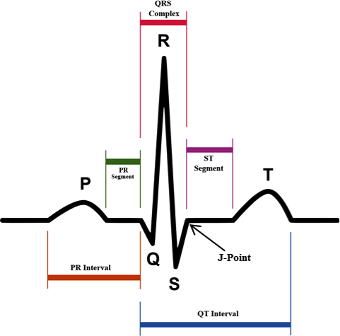
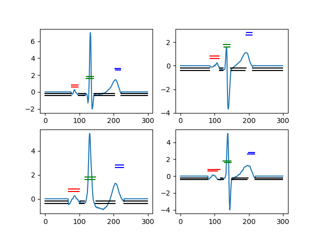
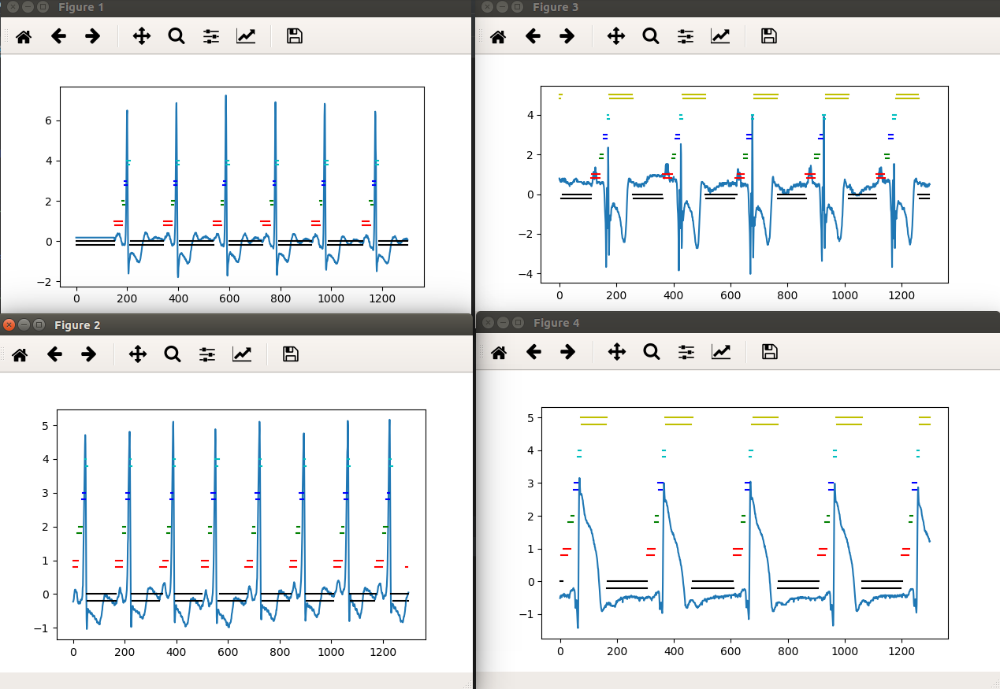

# ECG-Segment-LSTM
环境：python3 + pytorch1.0.0

ENV:python3 + pytorch1.0.0

依赖的包：wfdb、pickle、numpy、scipy、matplotlib

Independent Package:wfdb、pickle、numpy、scipy、matplotlib

使用数据库：https://physionet.org/physiobank/database/qtdb/

Used database Url:https://physionet.org/physiobank/database/qtdb/

参考链接：https://github.com/niekverw/Deep-Learning-Based-ECG-Annotator

Ref Rep:https://github.com/niekverw/Deep-Learning-Based-ECG-Annotator

本工程通过LSTM模型实现了对ECG信号的波形分割，共6个波形：背景、P波、PQ段、QR段、RS段、ST段，分别对应标签0~5

This project achieved ECG signal wave segmentation,by using LSTM net.There are six waves:background/P Segment/PQ Seg/QR Seg/RS Seg/ST Seg,label is 0~6.

## Getting Start
* 下载qt数据集至qtdb文件夹， 应该包含.hed .q1c等后缀格式文件

  download qtdb,including .hed .q1c files

* 运行`python qtdatabase.py` 会在qtdb_pkl文件下生成train_data.pkl和val_data.pkl

  run `python qtdatabase.py`, it will generate train_data.pkl and val_data.pkl in folder "qtdb_pkl"

* 运行`python model_lstm.py` 训练LSTM模型，模型存储在ckpt文件下

  run `python model_lstm.py` to training LSTM Net, its result will be in folder "ckpt"

一个心跳的各个波形的标注

The characteristic waves of a heart beat

阅读源代码和注释

Please to read the source code and annotations

## Output

下图为预测结果与标签对比，对于一组红色的线，上面那条为label，下面那条为predict val

The figure shows the predict and label, for example, a couple of red lines, the upper is label, the lower is predict

下面为连续heart beat的预测结果图,见代码multi_beats分支

several continue heart beat segment, please download branch multi_beats

## Result

我们使用了M±SD(ms)指标

| method | P-peak | Q-pose | R-peak | S-pose | T-peak
| ------ | ------ | ------ | ------ | ------ | -----
| our    |0.34±2.92|0.03±0.84|0.03±0.32|0.18±1.00|-0.06±1.29|
| RAN    |-0.4±10.1|-0.7±10.9|NA       |-4.8±13.1|-3.0±10.5|
| CNN    |3.9±14.2 |-0.3±14  |NA       |-6.6±15.2|-4.5±17.2|

我们使用了带有容忍误差(ms)的detection ACC的指标

|容忍误差(ms)|P-peak|Q-pose|R-Peak|S-pose|T-Peak|
|----------|------|------|------|------|-------|
|0.8       |75.96%|84.24%|98.74%|75.95%|72.37% |
|1.2       |88.03%|93.70%|99.58%|87.39%|85.29% |
|1.6       |94.01%|96.95%|99.58%|93.17%|90.86% |

## Network
2层双向LSTM构成特征提取层，2个使用了dropout的全连接层，最后一个softmax的输出层

two-layers bi-LSTM + two Linear layer with dropout + softmax output